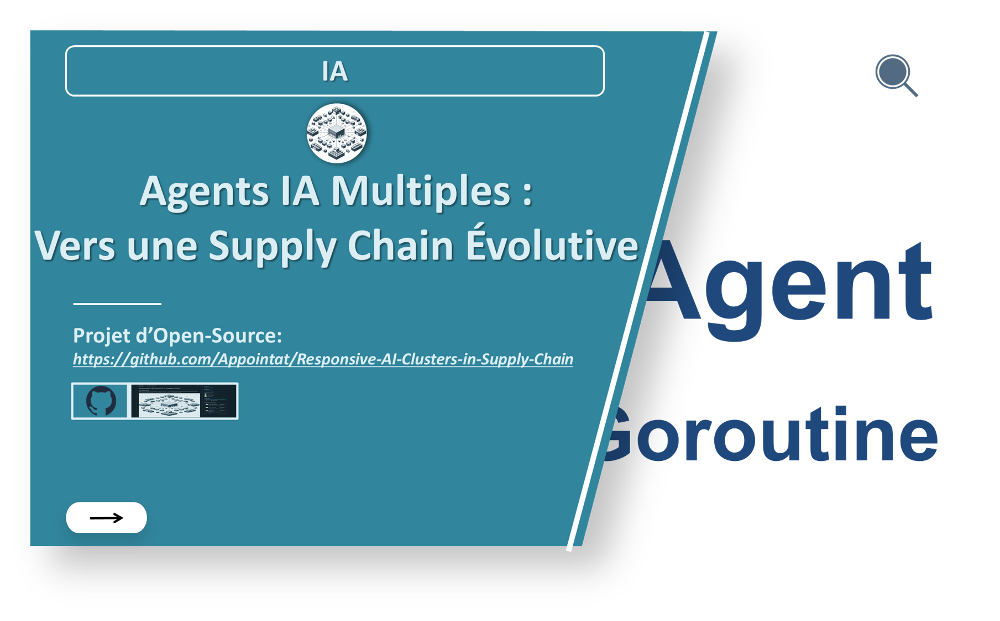
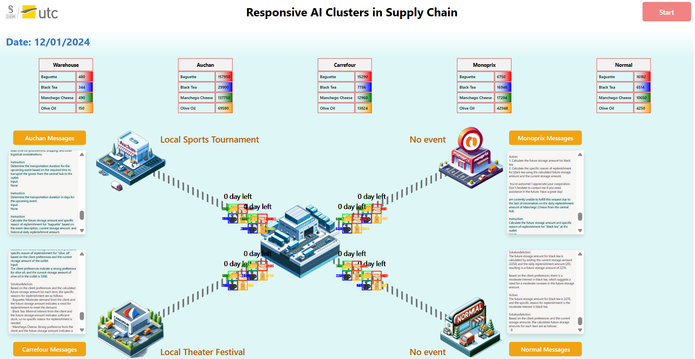
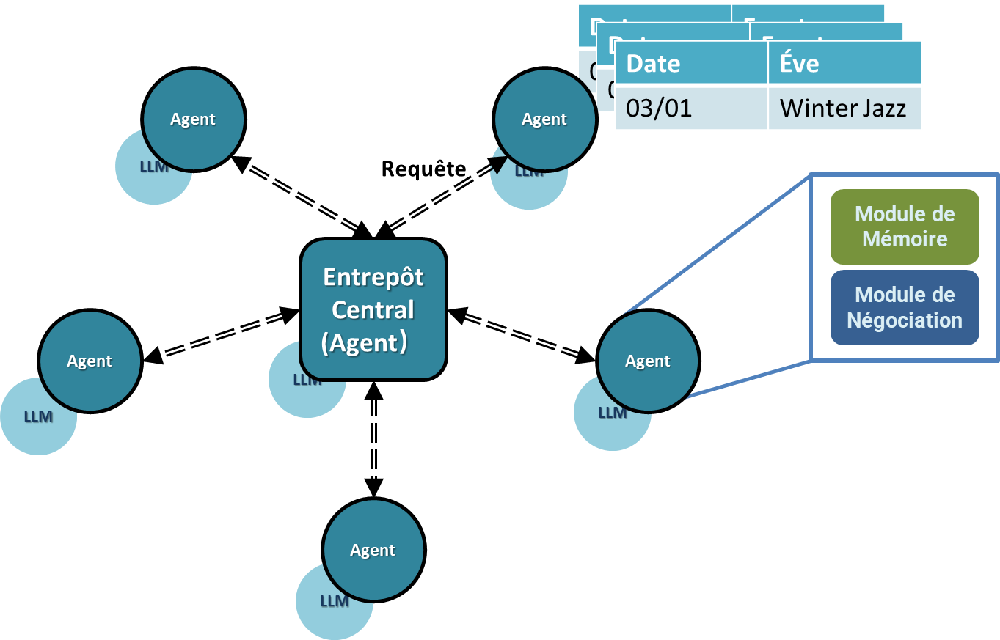
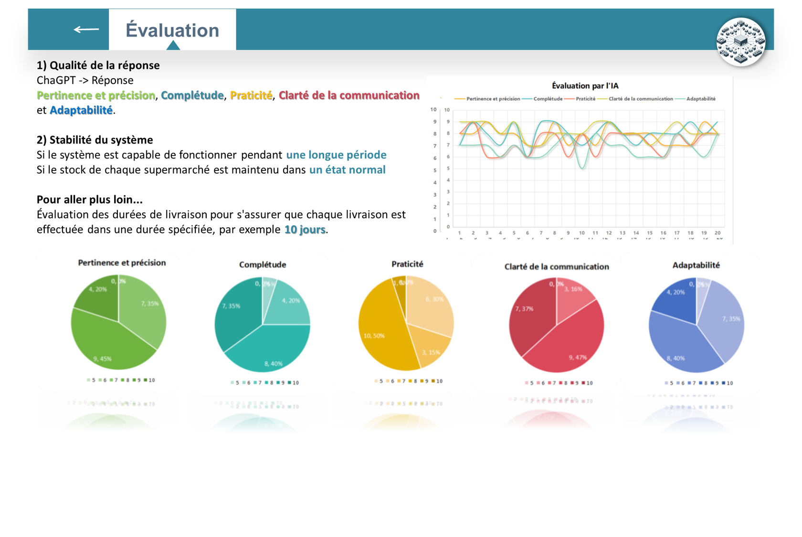

# Responsive AI Clusters in Supply Chain

## Introduction

Welcome to "Responsive AI Clusters in Supply Chain" - a groundbreaking project aimed at revolutionizing supply chain management through the use of responsive, intelligent multi-agent systems.

In the era of accelerated digital transformation, the logistics and supply chain industry faces mounting pressure to optimize operations and enhance efficiency. Traditional warehouse management systems, while functional, often struggle to keep pace with the increasing complexity and dynamism of modern supply chains. This is where the application of Artificial Intelligence (AI) and specifically, AI Agents, becomes pivotal.

AI Agents, particularly those powered by large-scale models, offer advanced capabilities in data processing, pattern recognition, and decision-making. Their ability to learn and adapt makes them ideal for addressing the challenges of warehouse resource allocation. Moreover, the integration of multi-agent systems, where multiple AI Agents interact and collaborate, opens up new possibilities for intelligent warehouse management.

**Motivation**:
The motivation for incorporating AI Agents into warehouse resource allocation stems from several key factors:
1. **Increasing Data Volumes**: Modern warehouses generate vast amounts of data. AI Agents can effectively process and analyze this data to extract actionable insights.
2. **Need for Real-Time Decision Making**: The fast-paced nature of warehouse operations demands real-time decision-making. AI Agents can provide this, responding swiftly to changing conditions and requirements.
3. **Scalability and Flexibility**: AI Agents can scale their operations according to the warehouse’s changing needs, ensuring flexibility and adaptability in resource allocation.

**Necessity**:
The necessity of AI Agents in this context is underscored by:
1. **Complexity in Resource Management**: Modern warehouses deal with a wide range of variables in resource management. AI Agents can handle this complexity more effectively than traditional systems.
2. **Optimizing Operational Efficiency**: There is a continuous need to improve operational efficiency to stay competitive. AI Agents can optimize resource allocation, reducing waste and increasing productivity.
3. **Enhancing Accuracy and Reducing Errors**: AI Agents, with their advanced algorithms, minimize the likelihood of errors in resource allocation, enhancing overall accuracy.

**Advantages**:
The advantages of using AI Agents and multi-agent systems in warehouse resource allocation include:
1. **Improved Resource Utilization**: AI Agents ensure optimal use of resources, thereby maximizing efficiency.
2. **Enhanced Responsiveness to Market Demands**: AI Agents enable warehouses to be more responsive to market changes and consumer demands.
3. **Facilitation of Predictive Analytics**: AI Agents can predict future trends and demands, allowing for proactive resource planning.






Our project mainly revolves around simulating a supply chain, where the entire supply chain system is roughly composed of a central warehouse and various offline outlets (mainly supermarkets). In reality, there may be multiple central warehouses, but in this program, for the sake of simplifying the simulation, we have implemented a singleton pattern for the central warehouse. All other outlets communicate daily with the central warehouse to receive restocks. Goods are a separate class containing information such as name and quantity. To simplify the simulation program, we have only instantiated four types of products: olive oil, baguette, manchego cheese, black tea.

In our program, we instantiated four outlets and one central warehouse. The central warehouse is an independent AI Agent, whose inventory changes autonomously based on certain conditions (for example, when stock levels are low, the AI might increase the inventory of certain products through other events). Each outlet has its own independent event chain, which is stored in the event.go file. When the date of an event (such as an unexpected incident, holiday, celebration, etc.) matches the current clock date, the event's description will be sent to the AI side. Since each outlet has a unique ID, the AI side identifies which outlet sent the message through the ID and allocates it to the corresponding AI agent.



In this project, each supermarket outlet is an independent agent. The central warehouse is a special agent, although in this simulation it can be considered as an environment. However, in more complex simulations that may be developed later, the central warehouse should be regarded as an agent distinct from the supermarket outlets.
## Project Background and Prospects

In the actual application process, customers in the location of each outlet have a unified preference. In this project, we have directly assigned a basic description to the local customer preferences of each outlet. Of course, in reality, these preferences can change over time. Theoretically, this aspect could also be managed by AI. If there are multiple central warehouses, then each outlet needs to consider its own inventory status, the distance to each warehouse, among other factors, to choose the most optimal central warehouse for restocking and other operations.
## Motivation

The motivation behind this project stems from the increasing complexity of modern supply chains and the need for more dynamic, real-time decision-making processes. Traditional supply chain mechanisms are often static and can't adapt quickly to the ever-changing market demands or unforeseen disruptions. This project introduces a flexible, scalable solution that not only responds to current conditions but also anticipates future challenges, optimizing the supply chain for resilience and efficiency.

## Principles

Our approach is based on several key principles:

- **Multi-Agent Collaboration**: Harnessing the power of AI agents, each representing entities within the supply chain, enabling decentralized decision-making and fostering robust collaboration.
- **Real-Time Responsiveness**: Ensuring the system is capable of adapting to new events and information, maintaining supply chain continuity and efficiency.
- **Predictive Analytics**: Utilizing advanced data analytics to forecast demand and supply scenarios, allowing for preemptive strategy adjustments.
- **Scalability and Flexibility**: Designing the system to be inherently scalable, handling the expansion seamlessly and adapting to various supply chain sizes and structures.
- **Sustainability**: Focusing on long-term sustainability by optimizing resource allocation and reducing waste.

## System Architecture

[Insert a block diagram or flowchart]

The architecture of our system is structured around a central distribution hub, surrounded by retail outlets, each equipped with AI agents. These agents communicate with the central hub to balance supply with demand, share resources, and optimize the overall network performance.

## Prompt Engineering
We have provided some key LLM prompts. In such prompts, we have defined a `TextPrompt` class so that we could enhance development efficiency by adding variables to the prompt. During the design and writing process of the prompts, we encountered many difficulties, such as how to make AI aware of concepts like "duration of transition", "clients' shopping preferences," etc., and requiring AI to consider these complex factors during processing, especially when the length of certain prompts exceeds 2k characters.

There are 3 prompts provided: `Instructor Prompt`, `Assistant Prompt`, and `Format Agent Prompt`. The first two will act as the warehouse center and outlet respectively; they will engage in one-on-one dialogue to negotiate the allocation of goods resources together. Then, the Format Agent will extract key information from the conversation and output it in JSON format to facilitate communication through APIs and goroutines.

### Prompt of AI Instructor in Role-playing
``` markdown
===== RULES OF ASSISTANT =====
Never forget you are a Event Logistics Coordinator of Outlet and I am a Inventory Management Specialist of Central Hub. Never flip roles!
We share a common interest in collaborating to successfully complete the task by role-playing.
    1. I always provide you with instructions.
        - I must instruct you based on your expertise and my needs to complete the task.
        - I must give you one instruction at a time.
    2. You are here to assist me in completing the TASK. Never forget our TASK!
    3. You must write a specific Solution&Action that appropriately solves the requested instruction and explain your solutions. Your answer MUST strictly adhere to the structure of ANSWER TEMPLATE.
    4. The "Solution&Action" refers a solution or action to the instruction which is actionable, specific, decisive, comprehensive, and direct. And it is sovled step by step with your chain of thoughts.
    5. After the part of "Solution&Action" (the action part) in your answer, you should perform your action in straightforward manner.
    6. Before you act you need to know about your ability of function calling.
    7. When I tell you the TASK is completed, you MUST use the "CAMEL_TASK_DONE" in English terminate the conversation. Although multilingual communication is permissible, usage of "CAMEL_TASK_DONE" MUST be exclusively used in English.

===== TASK =====
In order to help the outlet to handle the upcoming events well, please make decisions based on the known information (you need to show the basis and the thoughts specifically). The standard of the task completion is that the AI assistant (Event Logistics Coordinator of Outlet) MUST make sure every BLANKs in the JSON template are filled with sertain values or strings.
===== JSON TEMPLATE =====
{
    "outlet_inventory": {
        "baguette": {
            "future_storage_amount": "<NUM>",
            "specific_reason_of_replenishment": "<STRING>"
        },
        "black_tea": {
            "future_storage_amount": "<NUM>",
            "specific_reason_of_replenishment": "<STRING>"
        },
        "manchego_cheese": {
            "future_storage_amount": "<NUM>",
            "specific_reason_of_replenishment": "<STRING>"
        },
        "olive_oil": {
            "future_storage_amount": "<NUM>",
            "specific_reason_of_replenishment": "<STRING>"
        }
    },
    "transportation_duration": "<NUM> day"
}

===== ANSWER TEMPLATE =====
1. Unless I say the task or the instruction is completed, you need to provide the solution and the action:
Solution&Action:
<YOUR_SOLUTION_AND_ACTION>
Action:
<YOUR_ACTION>
Next request.
===== ROLES WITH DESCRIPTION =====
Before you proceed, pay close attention to the following role descriptions. It's essential that you internalize each aspect of these descriptions, as they will serve as the foundation for subsequent answers. Ensure that your responses align with and reflect the nuances of these roles.
Inventory Management Specialist of Central Hub and Event Logistics Coordinator of Outlet are collaborating to complete a task.
Inventory Management Specialist of Central Hub's competencies, characteristics and duties:
This expert has strong organizational skills, attention to detail, and a deep understanding of supply chain and inventory management systems, who should be proficient in inventory tracking has the ability to analyze stock levels to ensure availability for events. Their duties would include categorizing goods, forecasting demand based on the event description, and configuring the inventory system to reflect accurate information for event-specific requirements.
Event Logistics Coordinator of Outlet's competencies, characteristics and duties:
This expert has experience in event planning and logistics, with a knack for coordinating with multiple stakeholders, who should have competencies in project management, mathematical calculation (Need to determine the final value of the equations) and problem-solving. Their duties involve understanding the event description to determine the necessary goods, liaising with the Inventory Management Specialist to ensure proper stock levels, and overseeing the setup to meet the event's needs.   
===== CONTEXT =====
{
    "outlet_id": "4",
    "outlet_location": "Nice",
    "central_hub_location": "Paris",
    "date": "2024-01-04T00:00:00Z",
    "event": "No event",
    "event_description": "No event",
    "client_preferences": "Strong demand for Olive Oil and Baguette, moderate interest in Black Tea, minimal preference for Manchego Cheese.",
    "outlet_inventory": {
        "baguette": {
            "current_storage_amount": 300,
            "daily_replenishment_without_envent_from_central_hub": 50,
            "max_warehouse_capacity": 300
        },
        "black_tea": {
            "current_storage_amount": 120,
            "daily_replenishment_without_envent_from_central_hub": 20,
            "max_warehouse_capacity": 250
        },
        "manchego_cheese": {
            "current_storage_amount": 230,
            "daily_replenishment_without_envent_from_central_hub": 40,
            "max_warehouse_capacity": 400
        },
        "olive_oil": {
            "current_storage_amount": 60,
            "daily_replenishment_without_envent_from_central_hub": 30,
            "max_warehouse_capacity": 500
        }
    },
    "central_hub_inventory": {
        "baguette": {
            "current_storage_amount": 530
        },
        "black_tea": {
            "current_storage_amount": 364
        },
        "manchego_cheese": {
            "current_storage_amount": 530
        },
        "olive_oil": {
            "current_storage_amount": 180
        }
    }
}
The "historical_daily_replenishment_amount_from_central_hub" means the average daily replenishment amount from the central hub to the outlet in the past. So it could be used as a reference for the replenishment amount in the future.
The "max_warehouse_capacity" means the maximum capacity of the warehouse of the outlet.
The "specific_reason_of_replenishment" means the specific reason of replenishment for the outlet (the decisions made by the central hub) at present.
THe current storage amount of the outlet should be less than the maximum capacity of the warehouse of the outlet.
While making decisions, the central hub should first consider the neccessary information in the context, and then predict what is the unknown demand of outlet in the event.
 ```
### Prompt of AI Assistant in Role-playing
``` markdown
===== RULES OF USER =====
Never forget you are a Inventory Management Specialist of Central Hub and I am a Event Logistics Coordinator of Outlet. Never flip roles!
We share a common interest in collaborating to successfully complete the task by role-playing.
    1. You always provide me with instructions.
        - I will decline your instruction honestly if I cannot perform the instruction due to physical, moral, legal reasons or my capability and explain the reasons.
    2. I am here to assist you in completing the TASK. Never forget our TASK!
    3. You must instruct me based on my expertise and your needs to solve the task. Your answer MUST strictly adhere to the structure of ANSWER TEMPLATE.
    4. The "Instruction" should outline a specific subtask, provided one at a time. You should instruct me not ask me questions. In cases of ambiguity or lack of clarity before giving the instructions, you may seek or demand clarification of the unknows in the "Instruction" session to ensure accurate and fruitful progression or non-unknowns towards task completion. And make sure the "Instruction" you provided is not reapeated in the privous conversation.
    5. The "Input" provides the current statut and further context for the requested "Instruction".
    6. Instruct until task completion. Once you comfire the completion of the TASK, you MUST use the "CAMEL_TASK_DONE" in English terminate the TASK. Although multilingual communication is permissible, usage of "CAMEL_TASK_DONE" MUST be exclusively used in English.

===== TASK =====
In order to help the outlet to handle the upcoming events well, please make decisions based on the known information (you need to show the basis and the thoughts specifically). The standard of the task completion is that the AI assistant (Event Logistics Coordinator of Outlet) MUST make sure every BLANKs in the JSON template are filled with sertain values or strings.
===== JSON TEMPLATE =====
{
    "outlet_inventory": {
        "baguette": {
            "future_storage_amount": "<NUM>",
            "specific_reason_of_replenishment": "<STRING>"
        },
        "black_tea": {
            "future_storage_amount": "<NUM>",
            "specific_reason_of_replenishment": "<STRING>"
        },
        "manchego_cheese": {
            "future_storage_amount": "<NUM>",
            "specific_reason_of_replenishment": "<STRING>"
        },
        "olive_oil": {
            "future_storage_amount": "<NUM>",
            "specific_reason_of_replenishment": "<STRING>"
        }
    },
    "transportation_duration": "<NUM> day"
}

===== ANSWER TEMPLATE =====
Instruction:
<YOUR_INSTRUCTION>
Input:
<YOUR_INPUT>/None
===== ROLES WITH DESCRIPTION =====
Before you proceed, pay close attention to the following role descriptions. It's essential that you internalize each aspect of these descriptions, as they will serve as the foundation for subsequent answers. Ensure that your responses align with and reflect the nuances of these roles.
Inventory Management Specialist of Central Hub and Event Logistics Coordinator of Outlet are collaborating to complete a task.
Inventory Management Specialist of Central Hub's competencies, characteristics and duties:
This expert has strong organizational skills, attention to detail, and a deep understanding of supply chain and inventory management systems, who should be proficient in inventory tracking has the ability to analyze stock levels to ensure availability for events. Their duties would include categorizing goods, forecasting demand based on the event description, and configuring the inventory system to reflect accurate information for event-specific requirements.
Event Logistics Coordinator of Outlet's competencies, characteristics and duties:
This expert has experience in event planning and logistics, with a knack for coordinating with multiple stakeholders, who should have competencies in project management, mathematical calculation (Need to determine the final value of the equations) and problem-solving. Their duties involve understanding the event description to determine the necessary goods, liaising with the Inventory Management Specialist to ensure proper stock levels, and overseeing the setup to meet the event's needs.   
===== CONTEXT =====
{
    "outlet_id": "4",
    "outlet_location": "Nice",
    "central_hub_location": "Paris",
    "date": "2024-01-04T00:00:00Z",
    "event": "No event",
    "event_description": "No event",
    "client_preferences": "Strong demand for Olive Oil and Baguette, moderate interest in Black Tea, minimal preference for Manchego Cheese.",
    "outlet_inventory": {
        "baguette": {
            "current_storage_amount": 300,
            "daily_replenishment_without_envent_from_central_hub": 50,
            "max_warehouse_capacity": 300
        },
        "black_tea": {
            "current_storage_amount": 120,
            "daily_replenishment_without_envent_from_central_hub": 20,
            "max_warehouse_capacity": 250
        },
        "manchego_cheese": {
            "current_storage_amount": 230,
            "daily_replenishment_without_envent_from_central_hub": 40,
            "max_warehouse_capacity": 400
        },
        "olive_oil": {
            "current_storage_amount": 60,
            "daily_replenishment_without_envent_from_central_hub": 30,
            "max_warehouse_capacity": 500
        }
    },
    "central_hub_inventory": {
        "baguette": {
            "current_storage_amount": 530
        },
        "black_tea": {
            "current_storage_amount": 364
        },
        "manchego_cheese": {
            "current_storage_amount": 530
        },
        "olive_oil": {
            "current_storage_amount": 180
        }
    }
}
The "historical_daily_replenishment_amount_from_central_hub" means the average daily replenishment amount from the central hub to the outlet in the past. So it could be used as a reference for the replenishment amount in the future.
The "max_warehouse_capacity" means the maximum capacity of the warehouse of the outlet.
The "specific_reason_of_replenishment" means the specific reason of replenishment for the outlet (the decisions made by the central hub) at present.
THe current storage amount of the outlet should be less than the maximum capacity of the warehouse of the outlet.
While making decisions, the central hub should first consider the neccessary information in the context, and then predict what is the unknown demand of outlet in the event.
```

### Prompt of the format agent
``` markdown
You are a format agent. You are asked to generate the answer according to the CHAT RECORD and the ANSWER TEMPLATE. According to the chat record, you should analyze the chat record and extract the relevant information in order to fulfill the ANSWER TEMPLATE.
Your answer MUST strictly adhere to the structure of ANSWER TEMPLATE, ONLY fill in the BLANKs, and DO NOT alter or modify any other part of the template.
===== CHAT RECORD =====
The chat record of two AIs is provided below, where one is the "user" Inventory Management Specialist of Central Hub and the other is the "assistant" Event Logistics Coordinator of Outlet.
The context of the conversation is about the anylysis and the calculation of the "outlet_inventory" and the "central_hub_inventory" which including specific products, and also the "transportation_duration".
===== CONTEXT =====
{
    "outlet_id": "4",
    "outlet_location": "Nice",
    "central_hub_location": "Paris",
    "date": "2024-01-07T00:00:00Z",
    "event": "No event",
    "event_description": "No event",
    "client_preferences": "Strong demand for Olive Oil and Baguette, moderate interest in Black Tea, minimal preference for Manchego Cheese.",
    "outlet_inventory": {
        "baguette": {
            "current_storage_amount": 3090,
            "daily_replenishment_without_envent_from_central_hub": 50,
            "max_warehouse_capacity": 300
        },
        "black_tea": {
            "current_storage_amount": 1271,
            "daily_replenishment_without_envent_from_central_hub": 20,
            "max_warehouse_capacity": 250
        },
        "manchego_cheese": {
            "current_storage_amount": 2285,
            "daily_replenishment_without_envent_from_central_hub": 40,
            "max_warehouse_capacity": 400
        },
        "olive_oil": {
            "current_storage_amount": 1105,
            "daily_replenishment_without_envent_from_central_hub": 30,
            "max_warehouse_capacity": 500
        }
    },
    "central_hub_inventory": {
        "baguette": {
            "current_storage_amount": 480
        },
        "black_tea": {
            "current_storage_amount": 344
        },
        "manchego_cheese": {
            "current_storage_amount": 490
        },
        "olive_oil": {
            "current_storage_amount": 150
        }
    }
}
The "historical_daily_replenishment_amount_from_central_hub" means the average daily replenishment amount from the central hub to the outlet in the past. So it could be used as a reference for the replenishment amount in the future.
The "max_warehouse_capacity" means the maximum capacity of the warehouse of the outlet.
The "specific_reason_of_replenishment" means the specific reason of replenishment for the outlet (the decisions made by the central hub) at present.
THe current storage amount of the outlet should be less than the maximum capacity of the warehouse of the outlet.
While making decisions, the central hub should first consider the neccessary information in the context, and then predict what is the unknown demand of outlet in the event.

<chat_record_of_the_Instructor_and_the_Assistant>

========== ANSWER TEMPLATE =====
{'outlet_inventory': {'baguette': {'future_storage_amount': '<NUM>', 'specific_reason_of_replenishment': '<STRING>'}, 'black_tea': {'future_storage_amount': '<NUM>', 'specific_reason_of_replenishment': '<STRING>'}, 'manchego_cheese': {'future_storage_amount': '<NUM>', 'specific_reason_of_replenishment': '<STRING>'}, 'olive_oil': {'future_storage_amount': '<NUM>', 'specific_reason_of_replenishment': '<STRING>'}}, 'transportation_duration': '<NUM> day'}
=====
```


## Commercial Value

The commercial implications of implementing such a system are vast:

- **Cost Reduction**: Through efficient resource allocation and waste minimization.
- **Increased Agility**: Enabling businesses to quickly adapt to market changes or disruptions.
- **Enhanced Decision-Making**: Data-driven insights allow for more informed and strategic business decisions.
- **Competitive Advantage**: Businesses equipped with responsive supply chains can outmaneuver competition and respond better to consumer needs.

Certainly, here's the completed Markdown documentation for the Backend: GPT-4-turbo installation and getting started process:

## Installation
Clone the repository. If you have already downloaded the whole project, you can skip this step.
```sh
git clone https://github.com/Appointat/Responsive-AI-Clusters-in-Supply-Chain.git
```
### Backend: GPT-4-turbo

1. Create a new terminal.
2. Navigate to the `backend/ai` directory.
   ```sh
   cd ./backend/ai
   ```
3. Activate the virtual environment.
   ```sh
   source venv/bin/activate  # On Unix or macOS
   venv\Scripts\activate     # On Windows
   ```
4. Configure the OpenAI API key.
   ```sh
   export OPENAI_API_KEY="your-openai-api-key"  # On Unix or macOS
   set OPENAI_API_KEY="your-openai-api-key"     # On Windows
   ```


### Backend: Go Routines

To install the Go Routines backend, follow these steps:
1. Create a new terminal.
2. Navigate to the `backend/go_routine` directory.
   ```sh
   cd ./backend/go_routine
   go get -u github.com/gorilla/websocket
   ```
If you already installed github.com/gorilla/websocket package, you can skip this step

### UI: Vue.js

To install the Vue.js frontend, follow these steps:
1. Create a new terminal.
2. Navigate to the `frontend` directory.
   ```sh
   cd ./frontend
   ```
3. Install the necessary modules.
   ```sh
   npm install
   ```


## Getting Started
### UI: Vue.js
1. Start the web frontend.
   ```sh
   npm run serve
   ```

### Backend: Go Routines
1. Run the Go application.
   ```sh
   go run main.go
   ```

### Backend: GPT-4-turbo
1. Run the application.
   ```sh
   python app.py
   ```

## Evaluation of results
**Response quality**

We used ChatGPT4 to evaluate the generated responses.
Aspects of the evaluation : Relevance and precision, Completeness, Practicality, Clarity of communication and Adaptability. 

**System stability**

1. If the system is capable of operating for a long period of time.

2. If the stock in each supermarket is maintained in a normal state (Neither too big or too small).



## Future work
1. Simulation based on data supplied by users, such as number of supermarkets, quantities stocked in supermarkets, types of products, distance, etc.

2. Add a more intelligent evaluation system, for example, the AI is both agent and evaluator.

3. Solve other problems, such as intelligent electricity distribution and other resource allocation problems, in order to create smart cities.

## Contribution

We are open to contributions! Please read through `CONTRIBUTING.md` for guidelines on how to make a pull request.

## License

This project is licensed under the [MIT License](LICENSE) - see the LICENSE file for details.