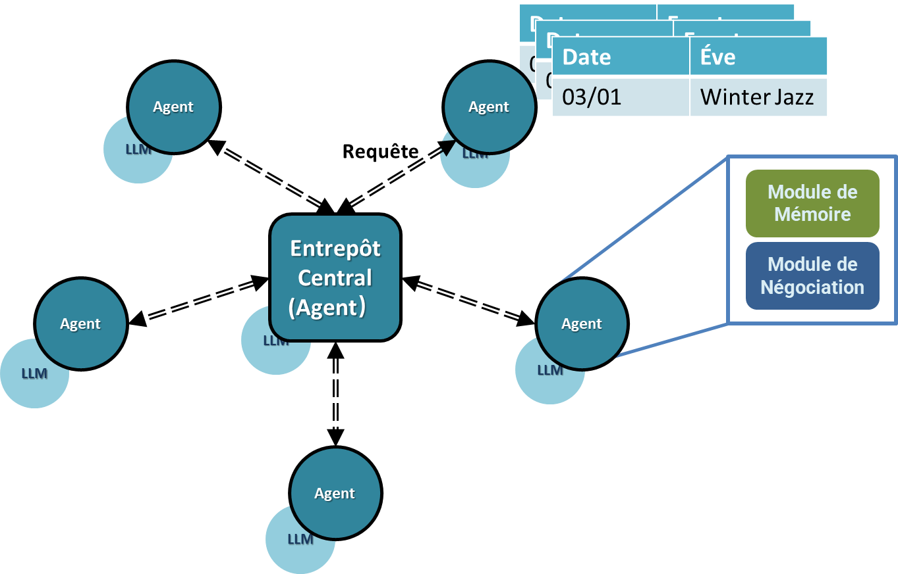

# Agents IA Multiples :​ Vers une Supply Chain Évolutive​

## Introduction

Bienvenue à "Agents IA Multiples :​ Vers une Supply Chain Évolutive​" - un projet novateur visant à révolutionner la gestion de la chaîne d'approvisionnement grâce à l'utilisation de systèmes multi-agents réactifs et intelligents.

À l'ère de la transformation numérique accélérée, l'industrie de la logistique et de la chaîne d'approvisionnement est confrontée à une pression croissante pour optimiser les opérations et améliorer l'efficacité. Les systèmes traditionnels de gestion d'entrepôt, bien que fonctionnels, peinent souvent à suivre le rythme de la complexité et du dynamisme croissants des chaînes d'approvisionnement modernes. C'est là que l'application de l'intelligence artificielle (IA), et plus particulièrement des agents d'IA, devient cruciale.

Les agents d'IA, en particulier ceux qui sont alimentés par des modèles à grande échelle, offrent des capacités avancées en matière de traitement des données, de reconnaissance des formes et de prise de décision. Leur capacité d'apprentissage et d'adaptation les rend idéaux pour relever les défis de l'allocation des ressources dans les entrepôts. En outre, l'intégration de systèmes multi-agents, dans lesquels plusieurs agents d'intelligence artificielle interagissent et collaborent, ouvre de nouvelles possibilités pour la gestion intelligente des entrepôts.

### Motivation:
La motivation pour incorporer des agents d'intelligence artificielle dans l'allocation des ressources d'un entrepôt provient de plusieurs facteurs clés :
1. **Volumes de données croissants** : Les entrepôts modernes génèrent de grandes quantités de données. Par exemple, la localisation géographique, la météo, les profils des utilisateurs, etc. Les agents d'IA peuvent traiter et analyser efficacement ces données pour en extraire des informations exploitables.
2. **Nécessité d'une prise de décision en temps réel** : La nature rapide des opérations d'entreposage exige une prise de décision en temps réel. Les agents d'intelligence artificielle peuvent y répondre, en réagissant rapidement à l'évolution des conditions et des exigences. Par exemple, les points de vente doivent préparer davantage de stocks de marchandises avant Noël.
3. **Évolutivité et flexibilité** : Les agents d'intelligence artificielle peuvent adapter leurs opérations en fonction de l'évolution des besoins de l'entrepôt, ce qui garantit la flexibilité et l'adaptabilité de l'allocation des ressources.

**Nécessité**:
La nécessité des agents d'intelligence artificielle dans ce contexte est soulignée par les éléments suivants
1. **Complexité de la gestion des ressources** : Les entrepôts modernes gèrent un large éventail de variables dans la gestion des ressources. Les agents d'intelligence artificielle peuvent gérer cette complexité plus efficacement que les systèmes traditionnels.
2. **Optimisation de l'efficacité opérationnelle** : Il est constamment nécessaire d'améliorer l'efficacité opérationnelle pour rester compétitif. Les agents d'intelligence artificielle peuvent optimiser l'allocation des ressources, en réduisant le gaspillage et en augmentant la productivité.

**Avantages**:
Les avantages de l'utilisation d'agents d'intelligence artificielle et de systèmes multi-agents dans l'affectation des ressources d'un entrepôt sont les suivants :
1. **Réactivité accrue aux demandes du marché** : Les agents d'intelligence artificielle permettent aux entrepôts d'être plus réactifs aux changements du marché et aux demandes des consommateurs.
2. **Facilitation de l'analyse prédictive** : Les agents d'intelligence artificielle peuvent prédire les tendances et les demandes futures, ce qui permet une planification proactive des ressources.

**Pourquoi choisir les systèmes multi-agents**

En raison de contraintes de temps, seuls quatre points de vente et un entrepôt central ont été mis en place dans le cadre de ce projet. 
Toutefois, le projet peut être étendu de manière flexible à davantage de supermarchés et d'entrepôts (des centaines d'agents). 
L'entrepôt et les supermarchés environnants peuvent être considérés comme **un cluster**, qui peut être régionale, nationale, mondiale, etc.

1. **Au sein des clusters - De puissantes capacités de prise de décision et de résolution de problèmes** : chaque point de vente est un agent, qui peut indépendamment collecter des informations et prendre des décisions pour différents événements.

2. **Entre des clusters - Traitement en temps réel de grandes quantités de données logistiques** : les systèmes multi-agents peuvent traiter en temps réel une grande quantité de données logistiques ainsi que la synchronisation. Par exemple, des articles sont transférés d'un entrepôt situé dans un autre pays et arrivent au point de vente en passant par l'entrepôt local. La quantité de données provenant de tous les clusters sera énorme.


L'utilisation de systèmes multi-agents d'IA pour résoudre des problèmes généraux est devenue un sujet populaire dans le secteur industriel. Notre exploration dans ce domaine est motivée par le désir de valider la faisabilité pratique de ces technologies. C'est ce qui a motivé la mise en œuvre de notre projet.

Le projet consiste principalement à simuler l'application de la chaîne d'approvisionnement, où le système entier de la chaîne d'approvisionnement est grosso modo composé d'un entrepôt central et de divers points de vente hors ligne (principalement des supermarchés). En réalité, il peut y avoir plusieurs entrepôts centraux, mais dans le projet, pour simplifier la simulation, nous avons mis en œuvre l'entrepôt central et chaque point de vente comme un agent unique (5 agents au total). Dans le projet, tous les autres points de vente communiquent quotidiennement avec l'entrepôt central pour recevoir des réapprovisionnements. Les marchandises sont une classe distincte contenant des informations telles que le nom et la quantité. Pour simplifier le programme de simulation, nous n'avons instancié que quatre types de produits : `olive oil`, `baguette`, `manchego cheese`, `black tea`.

Dans le programme, nous avons instancié quatre points de vente et un entrepôt central. L'entrepôt central est un agent IA indépendant, dont l'inventaire change de manière autonome en fonction de certaines conditions (par exemple, lorsque les niveaux de stock sont bas, l'IA peut augmenter l'inventaire de certains produits par le biais d'autres événements). Chaque point de vente possède sa propre table d'événements, qui est stockée dans le fichier event.go. Lorsque la date d'un événement (incident inattendu, jour férié, célébration, etc.) correspond à la date de l'horloge, la description de l'événement est envoyée à l'IA. Étant donné que chaque point de vente possède un identifiant unique, l'entrepôt identifie le point de vente qui a envoyé le message grâce à l'identifiant, puis commence le jeu de rôle de l'IA (de l'entrepôt au point de vente).

En conclusion, l'architecture du système/projet est structurée autour d'un entrepôt central, entouré de points de vente, chacun équipé d'agents d'intelligence artificielle. Ces agents communiquent avec le hub central pour équilibrer l'offre et la demande, partager les ressources et optimiser les performances globales du réseau.



Dans ce projet, chaque point de vente du supermarché est un agent indépendant. L'entrepôt central est un agent spécial, bien que dans cette simulation il puisse être considéré comme un environnement. Cependant, dans des simulations plus complexes qui pourraient être développées ultérieurement, l'entrepôt central devrait être considéré comme un agent distinct des points de vente des supermarchés. Le backend AI et le backend Go étant indépendants, chaque fois que le backend Go envoie une requête au backend AI, ce dernier fait la distinction entre les différents supermarchés sur la base de l'identifiant reçu du point de vente du supermarché. Le backend AI crée un agent distinct pour l'entrepôt central et un agent pour chaque point de vente de supermarché. Par conséquent, lors de chaque interaction, seul l'agent de l'entrepôt central est au courant des informations globales, tandis que les informations des différents agents des supermarchés sont inconnues les unes des autres.

Pour assurer le bon fonctionnement de ce projet, nous, les développeurs, devons établir une série de calendriers d'événements. Chaque calendrier énumère les dates des événements et leurs descriptions correspondantes, comme Noël le 25 décembre ou un incendie qui s'est produit le 10 février. Ces événements se déroulent dans le futur, mais nous les déterminons à l'avance car nous ne faisons que simuler un bac à sable pour la distribution des marchandises. Par conséquent, les calendriers des événements peuvent être considérés comme la "poussée" qui anime le système, c'est-à-dire que lorsqu'un événement se produit, le détaillant et l'entrepôt central doivent prendre les mesures appropriées. Comme vous pouvez le constater, les agents possèdent des caractéristiques différentes (inventaire, emplacement géographique, ID, etc.), et les événements sont également difficiles à modéliser quantitativement. C'est pourquoi il est indispensable d'utiliser de grands modèles de langage (LLM) pour traiter ces situations complexes. C'est l'un des avantages significatifs de notre projet.

Supposons que nous ayons quatre supermarchés situés à Lyon, Nice, Caen et Amiens, et deux entrepôts centraux situés à Paris et à Marseille. Dans ce cas, chaque point de vente, agissant en tant qu'agent, doit tenir compte de divers facteurs pratiques tels que le temps de transport estimé et le coût pour décider quel entrepôt central doit recevoir en priorité les demandes de réapprovisionnement. Après avoir reçu une demande, l'entrepôt central analyse les informations de la demande et renvoie une réponse avec les informations sur les marchandises. Le processus de communication est alors complet, après quoi l'entrepôt central traite la demande suivante.

## Contexte et perspectives du projet

Dans le processus d'application réel, les clients de chaque point de vente ont une préférence unifiée. Dans ce projet, nous avons directement attribué une description de base aux préférences des clients locaux de chaque point de vente. Bien entendu, dans la réalité, ces préférences peuvent changer au fil du temps. En théorie, cet aspect pourrait également être géré par l'IA. S'il existe plusieurs entrepôts centraux, chaque point de vente doit tenir compte de l'état de ses stocks, de la distance qui le sépare de chaque entrepôt, entre autres facteurs, afin de choisir l'entrepôt central le plus optimal pour le réapprovisionnement et d'autres opérations.

## Principes de mise en œuvre des agents d'intelligence artificielle

Notre approche repose sur plusieurs principes clés :

- **Collaboration multi-agents** : Exploitation de la puissance des agents d'intelligence artificielle, chacun représentant des entités de la chaîne d'approvisionnement, permettant une prise de décision décentralisée et favorisant une collaboration solide.
- **Réactivité en temps réel** : S'assurer que le système est capable de s'adapter à de nouveaux événements et informations, afin de maintenir la continuité et l'efficacité de la chaîne d'approvisionnement.
- **Analyse prédictive** : L'utilisation d'analyses de données avancées pour prévoir les scénarios de demande et d'approvisionnement, permettant des ajustements stratégiques préventifs.
- **Évolutivité et flexibilité** : Concevoir le système pour qu'il soit intrinsèquement évolutif, gérer l'expansion de manière transparente et s'adapter aux différentes tailles et structures de la chaîne d'approvisionnement.
- **Durabilité** : Se concentrer sur la durabilité à long terme en optimisant l'allocation des ressources et en réduisant les déchets.


## Prompt Engineering
Nous avons fourni quelques invites LLM clés. Dans ces invites, nous avons défini une classe `TextPrompt` afin d'améliorer l'efficacité du développement en ajoutant des variables à l'invite. Au cours du processus de conception et d'écriture des messages-guides, nous avons rencontré de nombreuses difficultés, telles que la sensibilisation de l'IA à des concepts comme la "durée de la transition", les "préférences d'achat des clients", etc., et l'obligation pour l'IA de prendre en compte ces facteurs complexes au cours du traitement, en particulier lorsque la longueur de certains messages-guides dépasse 2 000 caractères.

There are 3 prompts provided: `Instructor Prompt`, `Assistant Prompt`, and `Format Agent Prompt`. The first two will act as the warehouse center and outlet respectively; they will engage in one-on-one dialogue to negotiate the allocation of goods resources together. Then, the Format Agent will extract key information from the conversation and output it in JSON format to facilitate communication through APIs and goroutines.

Il y a 3 invites fournies : `Instructor Prompt`, `Assistant Prompt`, et `Format Agent Prompt`. Les deux premiers vont jouer respectivement le rôle du centre de stockage et du point de vente ; ils vont engager un dialogue en tête-à-tête pour négocier ensemble l'allocation des ressources en marchandises. Ensuite, l'agent de formatage extrait les informations clés de la conversation et les restitue au format JSON pour faciliter la communication par le biais d'API et de goroutines.

### Prompt of AI Instructor in Role-playing
``` markdown
===== RULES OF ASSISTANT =====
Never forget you are a Event Logistics Coordinator of Outlet and I am a Inventory Management Specialist of Central Hub. Never flip roles!
We share a common interest in collaborating to successfully complete the task by role-playing.
    1. I always provide you with instructions.
        - I must instruct you based on your expertise and my needs to complete the task.
        - I must give you one instruction at a time.
    2. You are here to assist me in completing the TASK. Never forget our TASK!
    3. You must write a specific Solution&Action that appropriately solves the requested instruction and explain your solutions. Your answer MUST strictly adhere to the structure of ANSWER TEMPLATE.
    4. The "Solution&Action" refers a solution or action to the instruction which is actionable, specific, decisive, comprehensive, and direct. And it is sovled step by step with your chain of thoughts.
    5. After the part of "Solution&Action" (the action part) in your answer, you should perform your action in straightforward manner.
    6. Before you act you need to know about your ability of function calling.
    7. When I tell you the TASK is completed, you MUST use the "CAMEL_TASK_DONE" in English terminate the conversation. Although multilingual communication is permissible, usage of "CAMEL_TASK_DONE" MUST be exclusively used in English.

===== TASK =====
In order to help the outlet to handle the upcoming events well, please make decisions based on the known information (you need to show the basis and the thoughts specifically). The standard of the task completion is that the AI assistant (Event Logistics Coordinator of Outlet) MUST make sure every BLANKs in the JSON template are filled with sertain values or strings.
===== JSON TEMPLATE =====
{
    "outlet_inventory": {
        "baguette": {
            "future_storage_amount": "<NUM>",
            "specific_reason_of_replenishment": "<STRING>"
        },
        "black_tea": {
            "future_storage_amount": "<NUM>",
            "specific_reason_of_replenishment": "<STRING>"
        },
        "manchego_cheese": {
            "future_storage_amount": "<NUM>",
            "specific_reason_of_replenishment": "<STRING>"
        },
        "olive_oil": {
            "future_storage_amount": "<NUM>",
            "specific_reason_of_replenishment": "<STRING>"
        }
    },
    "transportation_duration": "<NUM> day"
}

===== ANSWER TEMPLATE =====
1. Unless I say the task or the instruction is completed, you need to provide the solution and the action:
Solution&Action:
<YOUR_SOLUTION_AND_ACTION>
Action:
<YOUR_ACTION>
Next request.
===== ROLES WITH DESCRIPTION =====
Before you proceed, pay close attention to the following role descriptions. It's essential that you internalize each aspect of these descriptions, as they will serve as the foundation for subsequent answers. Ensure that your responses align with and reflect the nuances of these roles.
Inventory Management Specialist of Central Hub and Event Logistics Coordinator of Outlet are collaborating to complete a task.
Inventory Management Specialist of Central Hub's competencies, characteristics and duties:
This expert has strong organizational skills, attention to detail, and a deep understanding of supply chain and inventory management systems, who should be proficient in inventory tracking has the ability to analyze stock levels to ensure availability for events. Their duties would include categorizing goods, forecasting demand based on the event description, and configuring the inventory system to reflect accurate information for event-specific requirements.
Event Logistics Coordinator of Outlet's competencies, characteristics and duties:
This expert has experience in event planning and logistics, with a knack for coordinating with multiple stakeholders, who should have competencies in project management, mathematical calculation (Need to determine the final value of the equations) and problem-solving. Their duties involve understanding the event description to determine the necessary goods, liaising with the Inventory Management Specialist to ensure proper stock levels, and overseeing the setup to meet the event's needs.   
===== CONTEXT =====
{
    "outlet_id": "4",
    "outlet_location": "Nice",
    "central_hub_location": "Paris",
    "date": "2024-01-04T00:00:00Z",
    "event": "No event",
    "event_description": "No event",
    "client_preferences": "Strong demand for Olive Oil and Baguette, moderate interest in Black Tea, minimal preference for Manchego Cheese.",
    "outlet_inventory": {
        "baguette": {
            "current_storage_amount": 300,
            "daily_replenishment_without_envent_from_central_hub": 50,
            "max_warehouse_capacity": 300
        },
        "black_tea": {
            "current_storage_amount": 120,
            "daily_replenishment_without_envent_from_central_hub": 20,
            "max_warehouse_capacity": 250
        },
        "manchego_cheese": {
            "current_storage_amount": 230,
            "daily_replenishment_without_envent_from_central_hub": 40,
            "max_warehouse_capacity": 400
        },
        "olive_oil": {
            "current_storage_amount": 60,
            "daily_replenishment_without_envent_from_central_hub": 30,
            "max_warehouse_capacity": 500
        }
    },
    "central_hub_inventory": {
        "baguette": {
            "current_storage_amount": 530
        },
        "black_tea": {
            "current_storage_amount": 364
        },
        "manchego_cheese": {
            "current_storage_amount": 530
        },
        "olive_oil": {
            "current_storage_amount": 180
        }
    }
}
The "historical_daily_replenishment_amount_from_central_hub" means the average daily replenishment amount from the central hub to the outlet in the past. So it could be used as a reference for the replenishment amount in the future.
The "max_warehouse_capacity" means the maximum capacity of the warehouse of the outlet.
The "specific_reason_of_replenishment" means the specific reason of replenishment for the outlet (the decisions made by the central hub) at present.
THe current storage amount of the outlet should be less than the maximum capacity of the warehouse of the outlet.
While making decisions, the central hub should first consider the neccessary information in the context, and then predict what is the unknown demand of outlet in the event.
 ```
### Prompt of AI Assistant in Role-playing
``` markdown
===== RULES OF USER =====
Never forget you are a Inventory Management Specialist of Central Hub and I am a Event Logistics Coordinator of Outlet. Never flip roles!
We share a common interest in collaborating to successfully complete the task by role-playing.
    1. You always provide me with instructions.
        - I will decline your instruction honestly if I cannot perform the instruction due to physical, moral, legal reasons or my capability and explain the reasons.
    2. I am here to assist you in completing the TASK. Never forget our TASK!
    3. You must instruct me based on my expertise and your needs to solve the task. Your answer MUST strictly adhere to the structure of ANSWER TEMPLATE.
    4. The "Instruction" should outline a specific subtask, provided one at a time. You should instruct me not ask me questions. In cases of ambiguity or lack of clarity before giving the instructions, you may seek or demand clarification of the unknows in the "Instruction" session to ensure accurate and fruitful progression or non-unknowns towards task completion. And make sure the "Instruction" you provided is not reapeated in the privous conversation.
    5. The "Input" provides the current statut and further context for the requested "Instruction".
    6. Instruct until task completion. Once you comfire the completion of the TASK, you MUST use the "CAMEL_TASK_DONE" in English terminate the TASK. Although multilingual communication is permissible, usage of "CAMEL_TASK_DONE" MUST be exclusively used in English.

===== TASK =====
In order to help the outlet to handle the upcoming events well, please make decisions based on the known information (you need to show the basis and the thoughts specifically). The standard of the task completion is that the AI assistant (Event Logistics Coordinator of Outlet) MUST make sure every BLANKs in the JSON template are filled with sertain values or strings.
===== JSON TEMPLATE =====
{
    "outlet_inventory": {
        "baguette": {
            "future_storage_amount": "<NUM>",
            "specific_reason_of_replenishment": "<STRING>"
        },
        "black_tea": {
            "future_storage_amount": "<NUM>",
            "specific_reason_of_replenishment": "<STRING>"
        },
        "manchego_cheese": {
            "future_storage_amount": "<NUM>",
            "specific_reason_of_replenishment": "<STRING>"
        },
        "olive_oil": {
            "future_storage_amount": "<NUM>",
            "specific_reason_of_replenishment": "<STRING>"
        }
    },
    "transportation_duration": "<NUM> day"
}

===== ANSWER TEMPLATE =====
Instruction:
<YOUR_INSTRUCTION>
Input:
<YOUR_INPUT>/None
===== ROLES WITH DESCRIPTION =====
Before you proceed, pay close attention to the following role descriptions. It's essential that you internalize each aspect of these descriptions, as they will serve as the foundation for subsequent answers. Ensure that your responses align with and reflect the nuances of these roles.
Inventory Management Specialist of Central Hub and Event Logistics Coordinator of Outlet are collaborating to complete a task.
Inventory Management Specialist of Central Hub's competencies, characteristics and duties:
This expert has strong organizational skills, attention to detail, and a deep understanding of supply chain and inventory management systems, who should be proficient in inventory tracking has the ability to analyze stock levels to ensure availability for events. Their duties would include categorizing goods, forecasting demand based on the event description, and configuring the inventory system to reflect accurate information for event-specific requirements.
Event Logistics Coordinator of Outlet's competencies, characteristics and duties:
This expert has experience in event planning and logistics, with a knack for coordinating with multiple stakeholders, who should have competencies in project management, mathematical calculation (Need to determine the final value of the equations) and problem-solving. Their duties involve understanding the event description to determine the necessary goods, liaising with the Inventory Management Specialist to ensure proper stock levels, and overseeing the setup to meet the event's needs.   
===== CONTEXT =====
{
    "outlet_id": "4",
    "outlet_location": "Nice",
    "central_hub_location": "Paris",
    "date": "2024-01-04T00:00:00Z",
    "event": "No event",
    "event_description": "No event",
    "client_preferences": "Strong demand for Olive Oil and Baguette, moderate interest in Black Tea, minimal preference for Manchego Cheese.",
    "outlet_inventory": {
        "baguette": {
            "current_storage_amount": 300,
            "daily_replenishment_without_envent_from_central_hub": 50,
            "max_warehouse_capacity": 300
        },
        "black_tea": {
            "current_storage_amount": 120,
            "daily_replenishment_without_envent_from_central_hub": 20,
            "max_warehouse_capacity": 250
        },
        "manchego_cheese": {
            "current_storage_amount": 230,
            "daily_replenishment_without_envent_from_central_hub": 40,
            "max_warehouse_capacity": 400
        },
        "olive_oil": {
            "current_storage_amount": 60,
            "daily_replenishment_without_envent_from_central_hub": 30,
            "max_warehouse_capacity": 500
        }
    },
    "central_hub_inventory": {
        "baguette": {
            "current_storage_amount": 530
        },
        "black_tea": {
            "current_storage_amount": 364
        },
        "manchego_cheese": {
            "current_storage_amount": 530
        },
        "olive_oil": {
            "current_storage_amount": 180
        }
    }
}
The "historical_daily_replenishment_amount_from_central_hub" means the average daily replenishment amount from the central hub to the outlet in the past. So it could be used as a reference for the replenishment amount in the future.
The "max_warehouse_capacity" means the maximum capacity of the warehouse of the outlet.
The "specific_reason_of_replenishment" means the specific reason of replenishment for the outlet (the decisions made by the central hub) at present.
THe current storage amount of the outlet should be less than the maximum capacity of the warehouse of the outlet.
While making decisions, the central hub should first consider the neccessary information in the context, and then predict what is the unknown demand of outlet in the event.
```

### Prompt of the format agent
``` markdown
You are a format agent. You are asked to generate the answer according to the CHAT RECORD and the ANSWER TEMPLATE. According to the chat record, you should analyze the chat record and extract the relevant information in order to fulfill the ANSWER TEMPLATE.
Your answer MUST strictly adhere to the structure of ANSWER TEMPLATE, ONLY fill in the BLANKs, and DO NOT alter or modify any other part of the template.
===== CHAT RECORD =====
The chat record of two AIs is provided below, where one is the "user" Inventory Management Specialist of Central Hub and the other is the "assistant" Event Logistics Coordinator of Outlet.
The context of the conversation is about the anylysis and the calculation of the "outlet_inventory" and the "central_hub_inventory" which including specific products, and also the "transportation_duration".
===== CONTEXT =====
{
    "outlet_id": "4",
    "outlet_location": "Nice",
    "central_hub_location": "Paris",
    "date": "2024-01-07T00:00:00Z",
    "event": "No event",
    "event_description": "No event",
    "client_preferences": "Strong demand for Olive Oil and Baguette, moderate interest in Black Tea, minimal preference for Manchego Cheese.",
    "outlet_inventory": {
        "baguette": {
            "current_storage_amount": 3090,
            "daily_replenishment_without_envent_from_central_hub": 50,
            "max_warehouse_capacity": 300
        },
        "black_tea": {
            "current_storage_amount": 1271,
            "daily_replenishment_without_envent_from_central_hub": 20,
            "max_warehouse_capacity": 250
        },
        "manchego_cheese": {
            "current_storage_amount": 2285,
            "daily_replenishment_without_envent_from_central_hub": 40,
            "max_warehouse_capacity": 400
        },
        "olive_oil": {
            "current_storage_amount": 1105,
            "daily_replenishment_without_envent_from_central_hub": 30,
            "max_warehouse_capacity": 500
        }
    },
    "central_hub_inventory": {
        "baguette": {
            "current_storage_amount": 480
        },
        "black_tea": {
            "current_storage_amount": 344
        },
        "manchego_cheese": {
            "current_storage_amount": 490
        },
        "olive_oil": {
            "current_storage_amount": 150
        }
    }
}
The "historical_daily_replenishment_amount_from_central_hub" means the average daily replenishment amount from the central hub to the outlet in the past. So it could be used as a reference for the replenishment amount in the future.
The "max_warehouse_capacity" means the maximum capacity of the warehouse of the outlet.
The "specific_reason_of_replenishment" means the specific reason of replenishment for the outlet (the decisions made by the central hub) at present.
THe current storage amount of the outlet should be less than the maximum capacity of the warehouse of the outlet.
While making decisions, the central hub should first consider the neccessary information in the context, and then predict what is the unknown demand of outlet in the event.

<chat_record_of_the_Instructor_and_the_Assistant>

===== ANSWER TEMPLATE =====
{'outlet_inventory': {'baguette': {'future_storage_amount': '<NUM>', 'specific_reason_of_replenishment': '<STRING>'}, 'black_tea': {'future_storage_amount': '<NUM>', 'specific_reason_of_replenishment': '<STRING>'}, 'manchego_cheese': {'future_storage_amount': '<NUM>', 'specific_reason_of_replenishment': '<STRING>'}, 'olive_oil': {'future_storage_amount': '<NUM>', 'specific_reason_of_replenishment': '<STRING>'}}, 'transportation_duration': '<NUM> day'}
```

## Installation
Cloner le dépôt. Si vous avez déjà téléchargé l'ensemble du projet, vous pouvez sauter cette étape.
```sh
git clone https://github.com/Appointat/Responsive-AI-Clusters-in-Supply-Chain.git
```
### Backend: GPT-4-turbo

1. Créer un nouveau terminal.
2. Naviguez vers le répertoire `back_end/ai`.
    ```sh
    cd ./back_end/ai
    ```
3. Activer l'environnement virtuel.
    ```sh
    python -m venv venv
    venv\Scripts\activate     # On Windows
    ```
4. Configurer la clé API OpenAI.
    ```sh
    $env:OPENAI_API_KEY="your-openai-api-key"     # On Windows
    ```
5. Installer les dépendances
    ``` sh
    python.exe -m pip install --upgrade pip
    poetry install
    pip install flask websockets matplotlib
    ```

### Backend: Go Routines

Pour installer le backend Go Routines, suivez les étapes suivantes :
1. Créer un nouveau terminal.
2. Naviguez vers le répertoire `back_end/go_routine`.
    ```sh
    cd ./back_end/go_routine
    go get -u github.com/gorilla/websocket
    ```
     Si vous avez déjà installé le paquet github.com/gorilla/websocket, vous pouvez sauter cette étape.

### UI: Vue.js

Pour installer le frontend Vue.js, suivez ces étapes :
1. Créer un nouveau terminal.
2. Naviguez vers le répertoire `front_end`.
    ```sh
    cd ./front_end
    ```
3. Installer les modules nécessaires.
    ```sh
    npm install
    ```

## Pour démarrer

### UI: Vue.js
1. Démarrer l'interface web.
    ```sh
    npm run serve
    ```
2. Ouvrez l'interface utilisateur dans la page web. (Ne rafraîchissez pas la page, car l'interface utilisateur effacerait alors les données précédemment mises en cache).
    ``` sh
    - Local:   http://localhost:8080/
    - Network: http://192.168.1.101:8080/
    ```

### Backend: GPT-4-turbo
1. Lancer l'application.
   ```sh
   python app.py
   ```

### Backend: Go Routines
1. Lancer l'application Go.
   ```sh
   go run main.go
   ```

### Cliquez sur le bouton
    
1. Après avoir configuré les goroutines, cliquez sur le bouton "Start" dans la page web de l'interface utilisateur.
   

L'ordre de démarrage de l'IA (python), du backend Go et du frontend (Vue.js) n'est pas strictement spécifié, mais il est nécessaire de s'assurer que le backend Go attend plusieurs secondes après le démarrage, afin de garantir que le programme s'exécute jusqu'à un point de blocage en attendant le message de démarrage du frontend. Après avoir démarré le backend Go et le backend AI, les deux entreront dans un état d'attente jusqu'à ce que l'utilisateur clique sur le frontend (comme indiqué dans le diagramme) pour envoyer un message de démarrage au backend Go. Dès réception du message, le backend Go commence à communiquer avec le backend AI et active le traitement des données du backend AI.


## Évaluation des résultats
**Qualité des réponses

Nous avons utilisé le GPT-4 pour évaluer les réponses générées.
Aspects de l'évaluation : Pertinence et précision, exhaustivité, praticité, clarté de la communication et adaptabilité. 

**Stabilité du système

1. Si le système est capable de fonctionner pendant une longue période.

2. Si le stock de chaque supermarché est maintenu dans un état normal (ni trop grand, ni trop petit).


## Valeur commerciale potentielle et perspectives d'avenir

L'application de systèmes multi-agents d'IA dans des secteurs tels qu'Amazon représente une frontière pleine de potentiel et de promesses pour l'avenir. Bien que l'état actuel de la technologie soit encore en évolution, les avantages attendus et les effets transformateurs de ces systèmes sont immenses, en particulier si l'on considère leur intégration future dans les réseaux mondiaux de vente au détail et de distribution.

## Travaux futurs
1. Simulation basée sur les données fournies par les utilisateurs, telles que le nombre de supermarchés, les quantités stockées dans les supermarchés, les types de produits, la distance, etc.

2. Ajouter un système d'évaluation plus intelligent, par exemple, l'IA est à la fois agent et évaluateur.

3. Résoudre d'autres problèmes, tels que la distribution intelligente d'électricité et d'autres problèmes d'allocation des ressources, afin de créer des villes intelligentes.

## Contribution

Nous sommes ouverts aux contributions ! Veuillez lire `CONTRIBUTING.md` pour les directives sur la façon de faire une demande de contribution.

## Licence

Ce projet est sous licence [MIT License](LICENSE) - voir le fichier LICENSE pour plus de détails.
